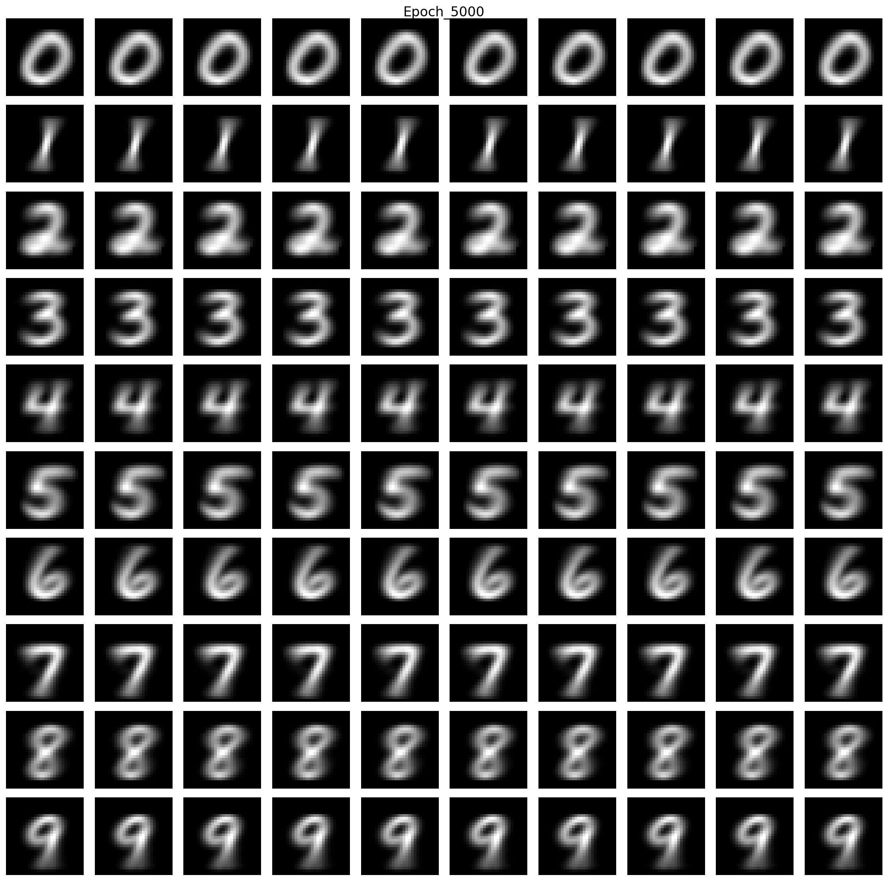
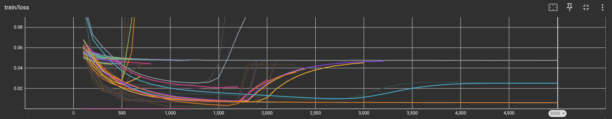
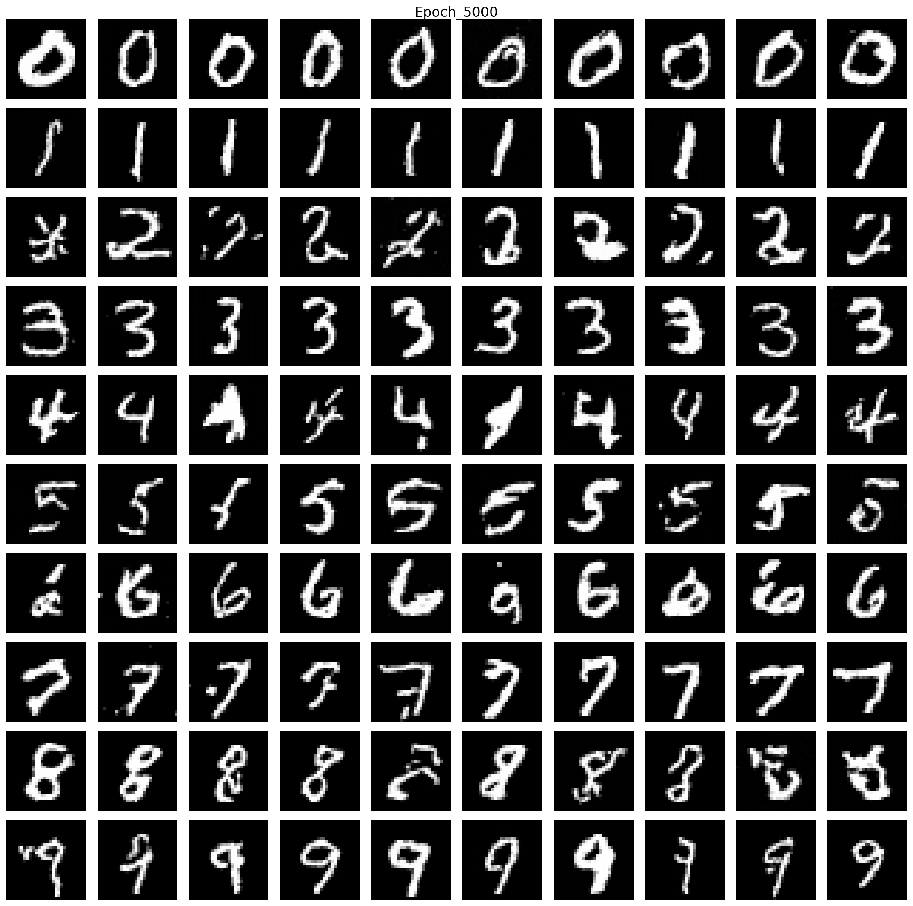
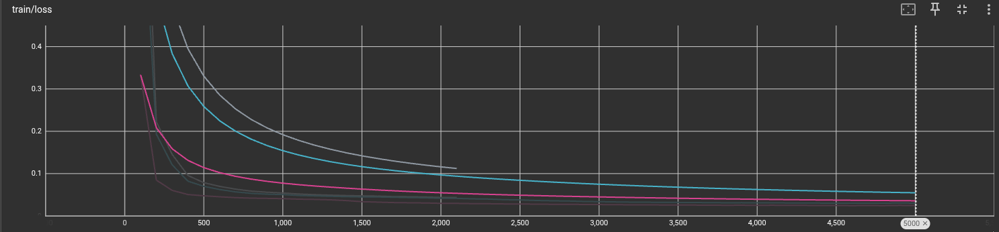
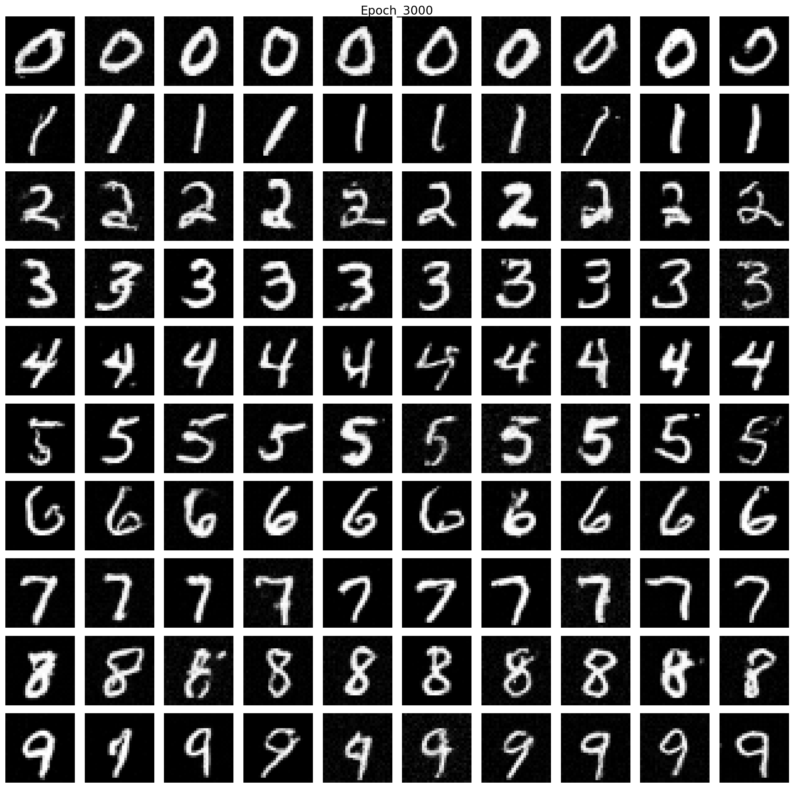
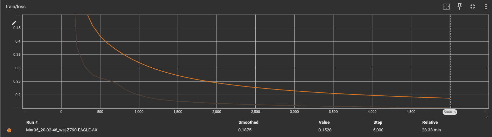

# Generative Modeling via Drifting - Unofficial

This repository reproduces the **Drift Loss** proposed in the paper "Generative Modeling via Drifting", with training on the MNIST dataset.

## Results
<table>
  <tr>
    <td align="center"></td>
  </tr>
  <tr>
    <td align="center">Generated MNIST Samples by vit and drift loss</td>
  </tr>
  <tr>
    <td align="center"></td>
  </tr>
  <tr>
    <td align="center">Training Loss Curve by vit and drift loss</td>
  </tr>
    <tr>
    <td align="center"></td>
  </tr>
  <tr>
    <td align="center">Generated MNIST Samples by dit model</td>
  </tr>
  <tr>
    <td align="center"></td>
  </tr>
  <tr>
    <td align="center">Training Loss Curve by dit model</td>
  </tr>
  <tr>
    <td align="center"></td>
  </tr>
  <tr>
    <td align="center">Generated MNIST Samples by flow matching model</td>
  </tr>
  <tr>
    <td align="center"></td>
  </tr>
  <tr>
    <td align="center">Training Loss Curve by flow matching model</td>
  </tr>
</table>


## Overview

- Paper: Generative Modeling via Drifting
- Task: Generative modeling on MNIST
- Core contribution: Reimplementation and verification of **Drift Loss**
- Framework: PyTorch

## Features

- Full implementation of Drift Loss
- Training pipeline on MNIST
- Loss curve and sample visualization
- Adjustable hyperparameters for stable training

## Requirements

```bash
pip install torch torchvision matplotlib numpy